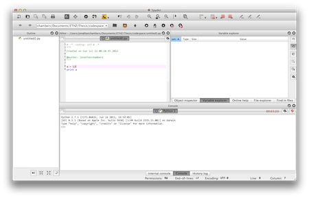

##Code

###Spyder
[Spyderlib](http://code.google.com/p/spyderlib/) is an IDE for writing scientific python code. For fun, I gave it a new icon theme using "symbolic" icons that I find look much better, especially on mac. For your viewing pleasure, here is a source distribution of my modified Spyder:  [Archive file](https://dl.dropbox.com/u/6613592/spyder-2.2.0dev.tar.gz)



[full size screenshot](img/spyder-mac.png)

You can run it via the command line from the source directory using:
```
python bootstrap.py
```

You need its dependancies installed, see information at the [spyderlib wiki](http://code.google.com/p/spyderlib/wiki/Installation).

***

###An optimized boids algorithm

Based on work dotted around the interwebs, I've thrown together an optimized implementation of Craig Reynold's boids-based flocking simulation algorithm. Nothing ground breaking: the idea is just to create an example implementation using a spacial tree to speed up the search for the nearest neighbours of each boids. This is the most basic improvement recommended by many boid tutorials but rarely implemented. The hope is that it will be of use to people looking to learn and understand how it works.

I have provided two versions here (both somewhat work in progress). The first is a light weight implementation which depends only on Pyglet for visualisation. The graphics and simulation code are pretty seperate, which should make it easy to change graphical representations. This version uses a simply dictionary of lists to create a grid of cells which accelerates the boid nearest-neighbour search. 

I found this resulted in playable framerates around 50fps, compared to 10 fps without this improvement - pretty good for python code!

See the code:

[Github Repo](https://github.com/jdchambers/optboid)

The second version is my attempt to use numpy to accelerate the actual vector operations involved in calculating boid movement. For instance, instead of having to loop through a list of boids to sum their velocities, numpy can rapidly sum over a whole array of velocities.

HOWEVER, due to the immaturity of the code and some bugs which i haven't tracked down yet, the result is actually slower than without numpy, and also less stable. One day, i will fix this!

See the code:

[Github Repo](https://github.com/jdchambers/pyboids)

Both these examples can be run by executing
```
python engine.py
```

(on mac/linux terminal, windows YMMV)

